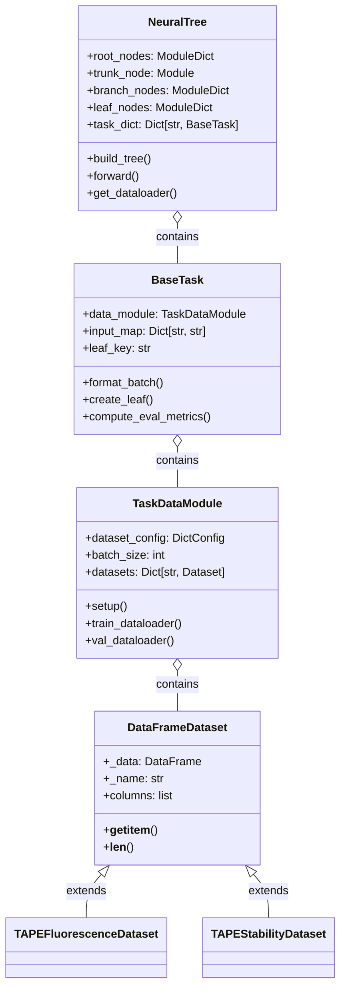

```mermaid
classDiagram
    class NeuralTree {
        +root_nodes: ModuleDict
        +trunk_node: Module
        +branch_nodes: ModuleDict
        +leaf_nodes: ModuleDict
        +task_dict: Dict[str, BaseTask]
        +build_tree()
        +forward()
        +get_dataloader()
    }

    class BaseTask {
        +data_module: TaskDataModule
        +input_map: Dict[str, str]
        +leaf_key: str
        +format_batch()
        +create_leaf()
        +compute_eval_metrics()
    }

    class TaskDataModule {
        +dataset_config: DictConfig
        +batch_size: int
        +datasets: Dict[str, Dataset]
        +setup()
        +train_dataloader()
        +val_dataloader()
    }

    class DataFrameDataset {
        +_data: DataFrame
        +_name: str
        +columns: list
        +__getitem__()
        +__len__()
    }

    NeuralTree o-- BaseTask : contains
    BaseTask o-- TaskDataModule : contains
    TaskDataModule o-- DataFrameDataset : contains
    DataFrameDataset <|-- TAPEFluorescenceDataset : extends
    DataFrameDataset <|-- TAPEStabilityDataset : extends
```