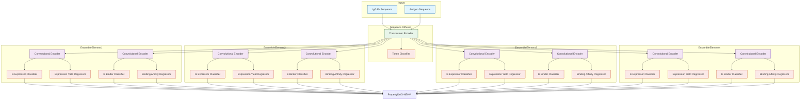

```mermaid
flowchart TB
    subgraph Inputs
        I1[IgG Fv Sequence]
        I2[Antigen Sequence]
    end

    subgraph Sequence Diffuser
        direction TB
        R1[Transformer Encoder]
        L5A[Token Classifier]
    end
    
    subgraph EnsembleElement1
        B1[Convolutional Encoder]
        L1A[Is Expressor Classifier]
        L1B[Expression Yield Regressor]
        B2[Convolutional Encoder]
        L2A[Is Binder Classifier]
        L2B[Binding Affinity Regressor]
    end
    
    subgraph EnsembleElement2
        B3[Convolutional Encoder]
        L3A[Is Expressor Classifier]
        L3B[Expression Yield Regressor]
        B4[Convolutional Encoder]
        L4A[Is Binder Classifier]
        L4B[Binding Affinity Regressor]
    end

    subgraph EnsembleElement3
        B6[Convolutional Encoder]
        L6A[Is Expressor Classifier]
        L6B[Expression Yield Regressor]
        B7[Convolutional Encoder]
        L7A[Is Binder Classifier]
        L7B[Binding Affinity Regressor]
    end
    
    subgraph EnsembleElement4
        B8[Convolutional Encoder]
        L8A[Is Expressor Classifier]
        L8B[Expression Yield Regressor]
        B9[Convolutional Encoder]
        L9A[Is Binder Classifier]
        L9B[Binding Affinity Regressor]
    end

    A1[PropertyDAG-NEHVI]

    I1 --> R1
    I2 --> R1

    R1 --> B1
    R1 --> B2
    R1 --> B3
    R1 --> B4

    R1 --> L5A

    R1 --> B6
    R1 --> B7
    R1 --> B8
    R1 --> B9
    
    B1 --> L1A
    B1 --> L1B
    B2 --> L2A
    B2 --> L2B
    B3 --> L3A
    B3 --> L3B
    B4 --> L4A
    B4 --> L4B

    B6 --> L6A
    B6 --> L6B
    B7 --> L7A
    B7 --> L7B
    B8 --> L8A
    B8 --> L8B
    B9 --> L9A
    B9 --> L9B
    
    L1A --> A1
    L1B --> A1
    L2A --> A1
    L2B --> A1
    L3A --> A1
    L3B --> A1
    L4A --> A1
    L4B --> A1
    L5A ~~~ A1
    L6A --> A1
    L6B --> A1
    L7A --> A1
    L7B --> A1
    L8A --> A1
    L8B --> A1
    L9A --> A1
    L9B --> A1

    classDef input fill:#e1f5fe,stroke:#01579b
    classDef root fill:#e8f5e9,stroke:#1b5e20  
    classDef branch fill:#f3e5f5,stroke:#4a148c
    classDef leaf fill:#fbe9e7,stroke:#bf360c

    class I1,I2 input
    class R1 root
    class B1,B2,B3,B4,B6,B7,B8,B9 branch
    class L1A,L1B,L2A,L2B,L3A,L3B,L4A,L4B,L5A,L6A,L6B,L7A,L7B,L8A,L8B,L9A,L9B leaf
```