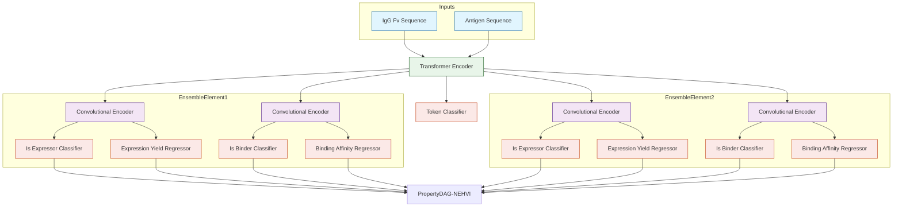

```mermaid
flowchart TB
    subgraph Inputs
        I1[IgG Fv Sequence]
        I2[Antigen Sequence]
    end
    R1[Transformer Encoder]
    subgraph EnsembleElement1
        B1[Convolutional Encoder]
        L1A[Is Expressor Classifier]
        L1B[Expression Yield Regressor]
        B2[Convolutional Encoder]
        L2A[Is Binder Classifier]
        L2B[Binding Affinity Regressor]
    end
    subgraph EnsembleElement2
        B3[Convolutional Encoder]
        L3A[Is Expressor Classifier]
        L3B[Expression Yield Regressor]
        B4[Convolutional Encoder]
        L4A[Is Binder Classifier]
        L4B[Binding Affinity Regressor]
    end
    L5A[Token Classifier]
    A1[PropertyDAG-NEHVI]

    I1 --> R1
    I2 --> R1
    R1 --> B1
    R1 --> B2
    R1 --> B3
    R1 --> B4
    R1 --> L5A
    B1 --> L1A
    B1 --> L1B
    B2 --> L2A
    B2 --> L2B
    B3 --> L3A
    B3 --> L3B
    B4 --> L4A
    B4 --> L4B
    L1A --> A1
    L1B --> A1
    L2A --> A1
    L2B --> A1
    L3A --> A1
    L3B --> A1
    L4A --> A1
    L4B --> A1

    classDef input fill:#e1f5fe,stroke:#01579b
    classDef root fill:#e8f5e9,stroke:#1b5e20  
    classDef branch fill:#f3e5f5,stroke:#4a148c
    classDef leaf fill:#fbe9e7,stroke:#bf360c

    class I1,I2 input
    class R1,R2 root
    class B1,B2,B3,B4 branch
    class L1A,L1B,L2A,L2B,L3A,L3B,L4A,L4B,L5A leaf
```