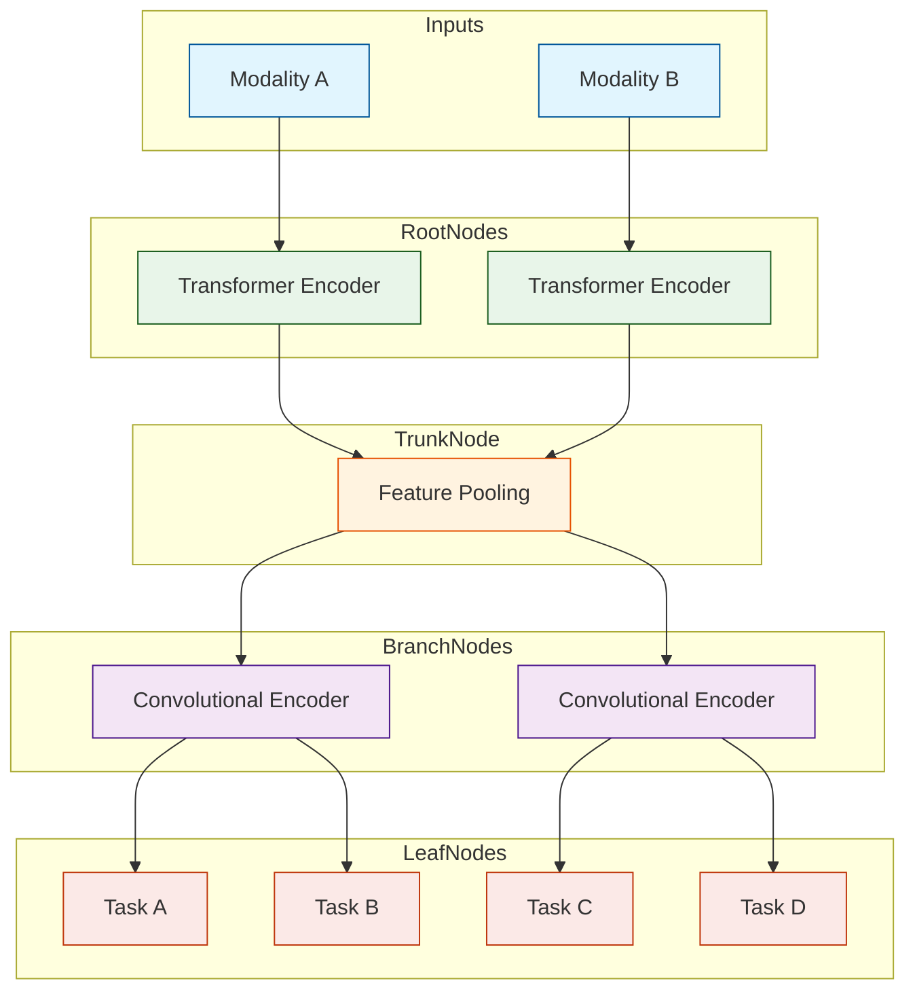

```mermaid
flowchart TB
    subgraph Inputs
        I1[Modality A]
        I2[Modality B]
    end

    subgraph RootNodes
        R1[Transformer Encoder]
        R2[Transformer Encoder]
    end

    subgraph TrunkNode
        T[Feature Pooling]
    end

    subgraph BranchNodes
        B1[Convolutional Encoder]
        B2[Convolutional Encoder]
    end

    subgraph LeafNodes
        L1[Task A]
        L1B[Task B]
        L2[Task C]
        L2B[Task D]
    end

    I1 --> R1
    I2 --> R2
    R1 --> T
    R2 --> T
    T --> B1
    T --> B2
    B1 --> L1
    B1 --> L1B
    B2 --> L2
    B2 --> L2B

    classDef input fill:#e1f5fe,stroke:#01579b
    classDef root fill:#e8f5e9,stroke:#1b5e20  
    classDef trunk fill:#fff3e0,stroke:#e65100
    classDef branch fill:#f3e5f5,stroke:#4a148c
    classDef leaf fill:#fbe9e7,stroke:#bf360c

    class I1,I2 input
    class R1,R2 root
    class T trunk
    class B1,B2 branch
    class L1,L1B,L2,L2B leaf
```